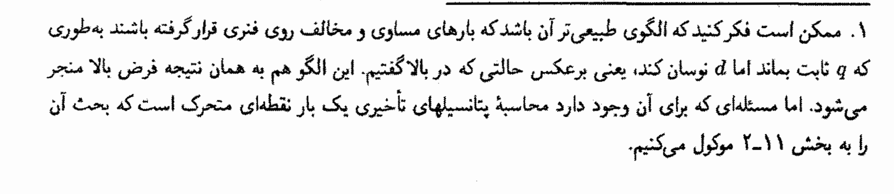
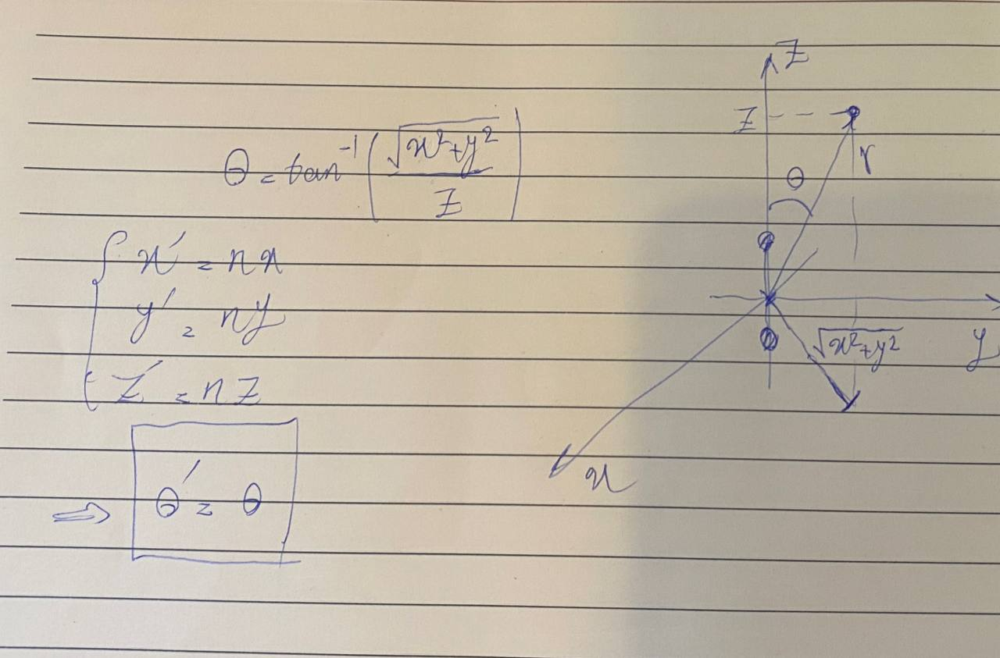
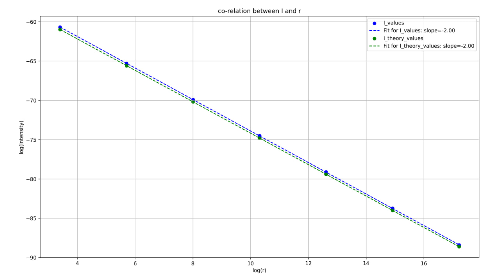
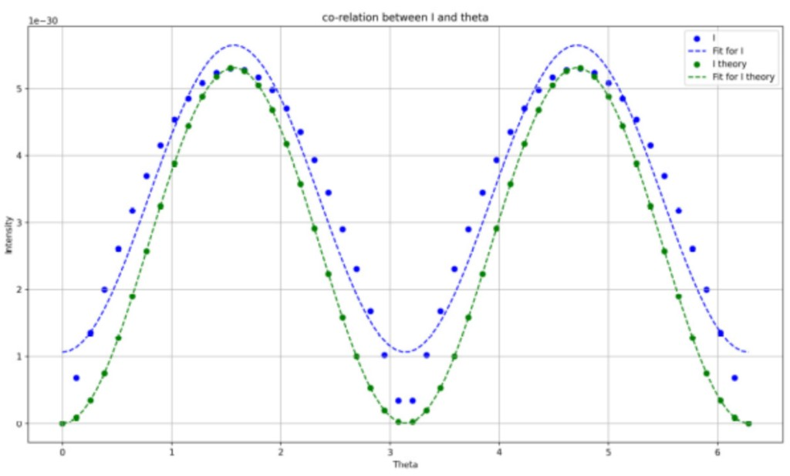
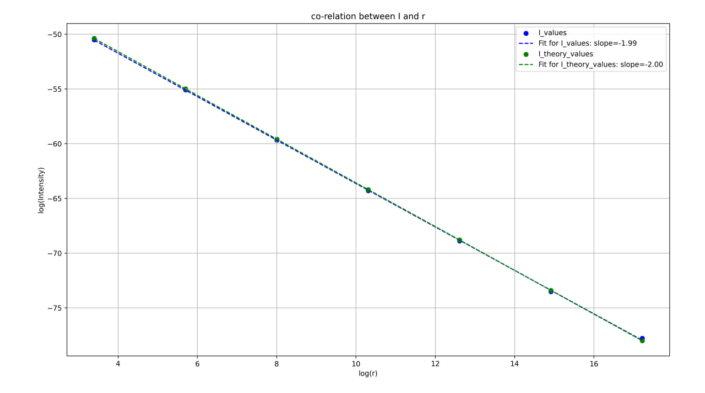
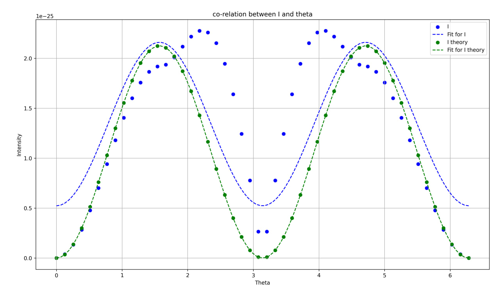

# Oscillating Dipoles

Electrodynamics course project by **Parsa Shahidi**. Numerical radiation from electric dipoles, compared with the approximate theory in Griffiths, *Introduction to Electrodynamics*, §11.1.2.

The report (Persian) is in [`Exact dipoles radiation.docx`](Exact%20dipoles%20radiation.docx).

## The question

Griffiths treats oscillating electric dipoles with several approximations. How much do those approximations change the radiated intensity?

The book also has a footnote that a “more natural” model — equal and opposite charges on a spring, so \(q\) is fixed while the separation \(d\) oscillates — should give the same radiation as the usual oscillating-charge model. That case needs retarded potentials of a moving point charge (Griffiths §11.2). This project checks both claims numerically.



Two simulations:

1. **Charge-oscillating dipole** — charges \(\pm q(t)\) at fixed positions — compared with the Griffiths formula.
2. **Length-oscillating dipole** — fixed charges, oscillating separation — compared with the *same* oscillating-charge theory (the footnote).

## Method

The codes use functional programming: intensity at a point is built from retarded distance \(\mathcal{R}\), scalar and vector potentials, Maxwell fields, the Poynting vector \(\mathbf{S}\), and a time average. Dependencies are NumPy, SciPy constants, and Matplotlib.

Finite-difference derivatives use a small step \(h\). The retarded distance for the length-oscillating dipole is solved by **fixed-point iteration**, because \(\mathcal{R}\) depends on retarded time and vice versa. Integrals (vector potential, time-averaged \(\mathbf{S}\)) use the trapezoidal rule.

The exact intensity is then compared with the far-field formula

\[
\langle S \rangle \propto \frac{(qd)^2\,\omega^4\sin^2\theta}{r^2}.
\]

To see the \(r\) and \(\theta\) dependence separately:

- **\(\theta\) fixed, \(r\) varied.** Scaling \((x,y,z)\) by a constant (here \(10\)) leaves \(\theta\) unchanged, so a log–log plot of \(I(r)\) should have slope \(-2\).



- **\(r\) fixed, \(\theta\) varied.** Sample points on a large circle in the \(y\)–\(z\) plane (\(x=0\)) and fit \(a\sin^2\theta + b\).

## Part 1 — Charge-oscillating dipole (`Oscillating_Charge.py`)

On a log–log plot both the exact intensity (blue) and Griffiths theory (green) fall as \(r^{-2}\) (slope \(-2.00\)). The two curves stay close, so the approximations are reasonable. Their ratio does **not** go to 1 at large \(r\); it stays roughly constant.



Versus angle, theory follows \(\sin^2\theta\) and goes to zero on the dipole axis. The exact intensity has the same peaks near \(\pi/2\) and \(3\pi/2\), but a non-zero floor. Agreement is better near the \(xy\)-plane (east/west on the sampling circle).



## Part 2 — Length-oscillating dipole (`Oscillating_Length.py`)

Here the charges move, so they radiate from velocity as well as acceleration. Versus \(r\), exact and oscillating-charge theory agree even more closely (slopes \(-1.99\) and \(-2.00\)).



Versus \(\theta\), the shapes differ more than in Part 1. Approximations are better near the poles of the sampling circle (along \(\pm z\)).



## Conclusion

Griffiths’ approximations are very good for the \(r\) dependence and acceptable for the \(\theta\) dependence. The footnote is confirmed: the two dipole models have similar radiation.

## Scripts

| File | Model |
| --- | --- |
| `Oscillating_Charge.py` | Fixed positions, oscillating charge |
| `Oscillating_Length.py` | Fixed charge, oscillating length (Liénard–Wiechert / retarded \(\mathcal{R}\)) |

```bash
pip install numpy scipy matplotlib
python Oscillating_Charge.py
python Oscillating_Length.py
```

## Reference

David J. Griffiths, *Introduction to Electrodynamics*.
